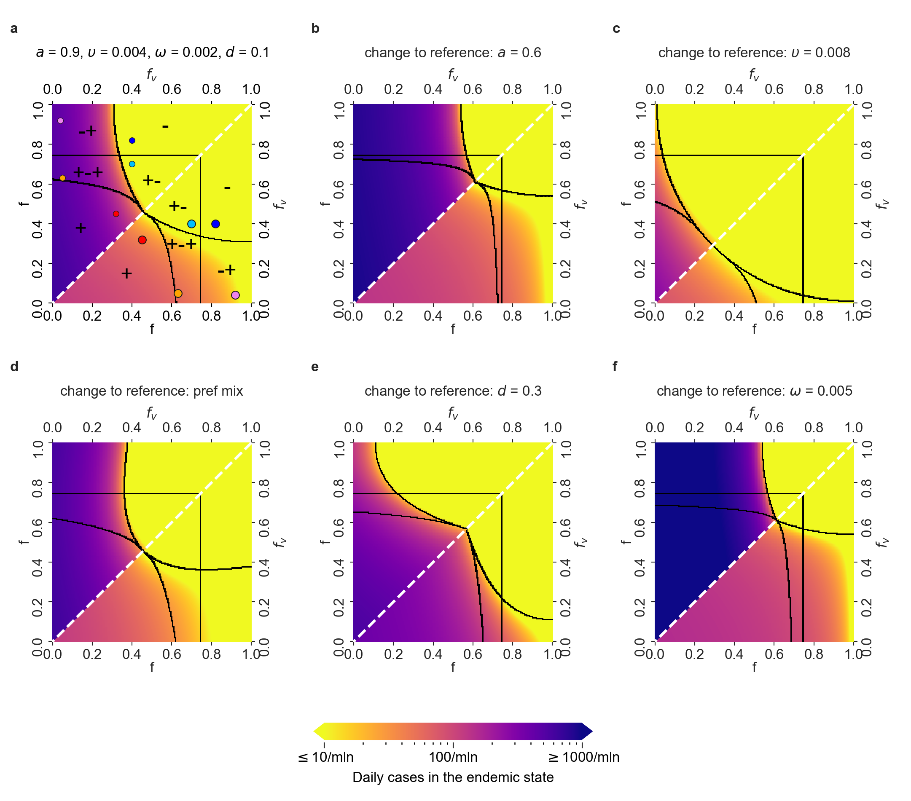

# Fig2_Fig3

This repository contains code to generate three figures from the paper
Krueger et al "Risk of COVID-19 epidemic resurgence with the introduction of vaccination passes".

## Prerequisities

- Python 3

## Installation

- `python3 -m venv venv`
- `. venv/bin/activate`
- `pip install -r requirements.txt`

Now all should be ready to run `python main.py`. It takes a moment to generate Fig 2,
around 90 minutes to generate Fig 3, and about 6 hours to generate Fig 4:

