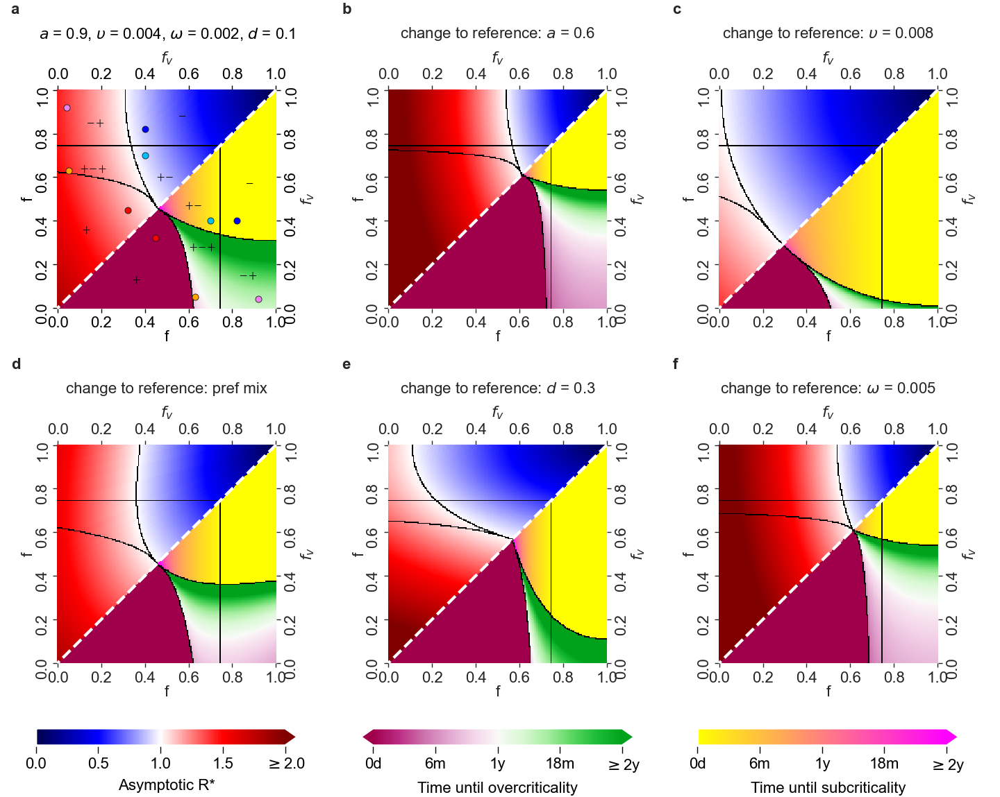

# Fig2_Fig3

This repository contains code to generate Fig2 and Fig3 from the paper [TBD].

## Prerequisities

- Python 3

## Installation

- `python3 -m venv venv`
- `. venv/bin/activate`
- `pip install -r requirements-txt`

Now you should be good to run `python main.py` and wait around 30 minutes to generate Fig 2 and Fig 3:

